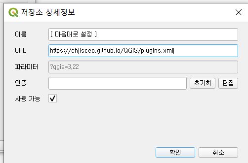

# QGIS 플러그인 튜닝 저장소

# StreetViewKorea
### 네이버 / 카카오 로드뷰 연계 툴
#### 기본 값은 네이버 로드뷰 입니다. Ctrl 키 누르고 사용 시 카카오 로드뷰 화면이 나타납니다.
#### QGIS Base Map에서 원하는 방향으로 드래그하여 사용하세요.

# ERROR Guide
#### MS Edge 경로 오류 시 edge_path.txt를 수정하셔서 사용 부탁드립니다. 

# 저장소 추가 방법
#### url : https://chjisceo.github.io/QGIS/plugins.xml
